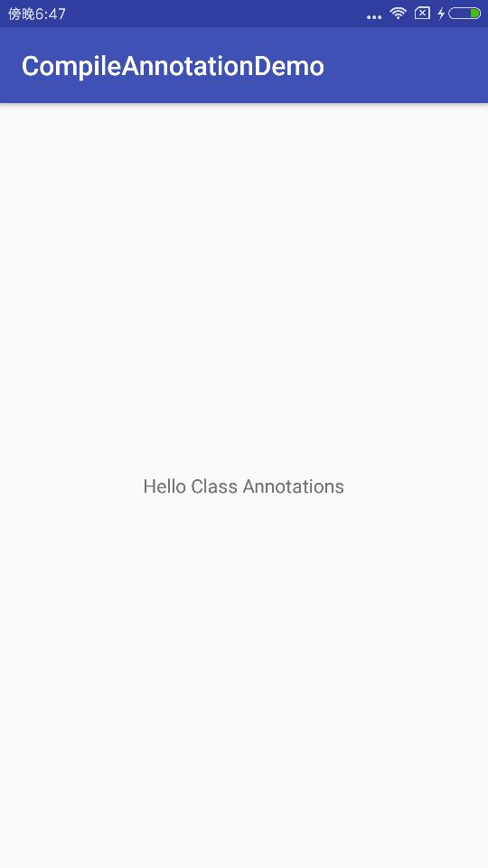

# CompileAnnotationDemo
Android中编译时注解实际运行Demo，仿照ButterKnife来写的

## 使用例子：

    @BindView(R.id.tv_content)
    TextView mContentTv;

    @Override
    protected void onCreate(Bundle savedInstanceState) {
        super.onCreate(savedInstanceState);
        setContentView(R.layout.activity_main);
        ViewBind.bind(this);

        mContentTv.setText("Hello Class Annotations");
    }

## 效果图

